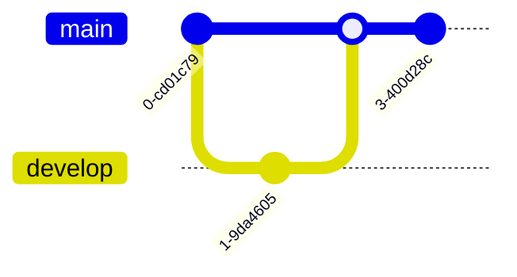

# @kayaozkur/mcp-server-mermaid

[](https://www.npmjs.com/package/@kayaozkur/mcp-server-mermaid)
[](https://opensource.org/licenses/MIT)
[](https://modelcontextprotocol.io)
[](https://nodejs.org/)
[](https://mermaid.js.org/)

A Model Context Protocol (MCP) server that provides comprehensive Mermaid diagram generation, analysis, and visual intelligence capabilities. This server enables AI assistants like Claude to create, analyze, and optimize visual documentation using Mermaid's powerful diagramming syntax.

## Features

### 🎨 Visual Intelligence Tools

- **Generate Diagrams from Code** - Automatically analyze source code and generate appropriate diagrams
- **Analyze Diagram Structure** - Get insights into diagram complexity, optimization opportunities
- **AI-Powered Improvements** - Receive intelligent suggestions for clearer, more effective diagrams
- **Workflow Visualization** - Transform process descriptions into visual workflows
- **Multi-Format Export** - Export diagrams to SVG, PNG, PDF, or interactive HTML
- **Syntax Validation** - Validate Mermaid syntax with detailed error reporting

### 🚀 Key Capabilities

- **Code Intelligence**: Analyze JavaScript, TypeScript, Python, Java, and more to generate architecture diagrams
- **Auto-Detection**: Intelligently determine the best diagram type for your content
- **Theme Support**: Multiple built-in themes for different contexts and preferences
- **High-Quality Rendering**: Powered by Puppeteer for pixel-perfect diagram generation
- **Real-time Validation**: Instant feedback on diagram syntax and structure

## Installation

```bash
# Install from npm (recommended)
npm install -g @kayaozkur/mcp-server-mermaid

# Or clone the repository for development
git clone https://github.com/kayaozkur/mcp-server-mermaid.git
cd mcp-server-mermaid

# Install dependencies
npm install

# Build the TypeScript code
npm run build
```

## Configuration

### Environment Variables

Create a `.env` file in the root directory (optional):

```env
# Optional: Log level (debug, info, warn, error)
LOG_LEVEL=info

# Optional: Default export directory
EXPORT_DIR=./exports

# Optional: Default theme
DEFAULT_THEME=default
```

### Claude Desktop Integration

Add the following to your Claude Desktop configuration file:

**macOS**: `~/Library/Application Support/Claude/claude_desktop_config.json`
**Windows**: `%APPDATA%\Claude\claude_desktop_config.json`

```json
{
  "mcpServers": {
    "mermaid": {
      "command": "npx",
      "args": ["@kayaozkur/mcp-server-mermaid"],
      "env": {
        "LOG_LEVEL": "info"
      }
    }
  }
}
```

Or if installed locally:

```json
{
  "mcpServers": {
    "mermaid": {
      "command": "node",
      "args": ["/path/to/mcp-server-mermaid/dist/index.js"]
    }
  }
}
```

## Available Tools

### 1. `generate_diagram_from_code`
Generate Mermaid diagrams by analyzing source code structure.

```typescript
{
  code: string,                    // Source code to analyze
  diagram_type?: 'flowchart' | 'sequence' | 'class' | 'state' | 'auto',  // Default: 'auto'
  language?: string,               // Programming language (e.g., 'javascript', 'python')
  include_details?: boolean        // Include detailed annotations (default: false)
}
```

**Example Use Cases**:
- Generate class diagrams from object-oriented code
- Create sequence diagrams from API interactions
- Build flowcharts from function logic
- Visualize state machines from state management code

### 2. `analyze_diagram_structure`
Analyze existing Mermaid diagrams for insights and metrics.

```typescript
{
  diagram_code: string,            // Mermaid diagram code to analyze
  analysis_type?: 'structure' | 'complexity' | 'optimization' | 'full'  // Default: 'full'
}
```

**Provides**:
- Node and edge counts
- Complexity metrics
- Structure patterns
- Optimization opportunities

### 3. `suggest_diagram_improvements`
Get AI-powered suggestions for improving diagram clarity and effectiveness.

```typescript
{
  diagram_code: string,            // Mermaid diagram code to improve
  context?: string,                // Context or purpose of the diagram
  audience?: 'technical' | 'business' | 'general' | 'documentation'  // Default: 'general'
}
```

**Suggestions Include**:
- Layout optimizations
- Labeling improvements
- Color and styling recommendations
- Simplification opportunities

### 4. `create_workflow_diagram`
Create workflow diagrams from textual descriptions.

```typescript
{
  workflow_description: string,    // Description of the workflow or process
  workflow_type: 'git' | 'cicd' | 'business' | 'development' | 'deployment',
  include_decision_points?: boolean,  // Include decision points (default: true)
  format?: 'flowchart' | 'sequence' | 'state' | 'gantt'  // Default: 'flowchart'
}
```

**Ideal For**:
- CI/CD pipeline visualization
- Git workflow documentation
- Business process mapping
- Development lifecycle diagrams

### 5. `export_diagram_formats`
Export Mermaid diagrams to various formats.

```typescript
{
  diagram_code: string,            // Mermaid diagram code to export
  format: 'svg' | 'png' | 'pdf' | 'html',
  output_path?: string,            // Optional output file path
  theme?: 'default' | 'dark' | 'forest' | 'neutral',  // Default: 'default'
  width?: number,                  // Width for raster formats (default: 1920)
  height?: number                  // Height for raster formats (default: 1080)
}
```

**Export Features**:
- Vector formats (SVG) for scalability
- Raster formats (PNG) for presentations
- PDF for documentation
- Interactive HTML with pan/zoom

### 6. `validate_diagram_syntax`
Validate Mermaid diagram syntax with detailed error reporting.

```typescript
{
  diagram_code: string,            // Mermaid diagram code to validate
  strict_mode?: boolean,           // Enable strict validation (default: false)
  provide_suggestions?: boolean    // Provide correction suggestions (default: true)
}
```

**Validation Includes**:
- Syntax checking
- Node reference validation
- Style rule compliance
- Best practice recommendations

## Supported Diagram Types

### Flowcharts

Perfect for: Process flows, decision trees, algorithms

### Sequence Diagrams

Perfect for: API interactions, communication flows, protocols

### Class Diagrams

Perfect for: Object relationships, system architecture, data models

### State Diagrams

Perfect for: State machines, UI flows, lifecycle management

### Gantt Charts

Perfect for: Project planning, timelines, task dependencies

### Git Graphs

Perfect for: Version control visualization, branching strategies

## Examples

### Example 1: Generate Architecture Diagram from Code

```javascript
// Ask Claude:
"Generate a class diagram from this TypeScript code:"

class UserService {
  constructor(private db: Database) {}
  
  async createUser(data: UserData): Promise<User> {
    return this.db.users.create(data);
  }
  
  async findUser(id: string): Promise<User | null> {
    return this.db.users.findById(id);
  }
}

class AuthService {
  constructor(
    private userService: UserService,
    private tokenService: TokenService
  ) {}
  
  async login(email: string, password: string): Promise<AuthToken> {
    const user = await this.userService.findByEmail(email);
    if (!user || !user.checkPassword(password)) {
      throw new Error('Invalid credentials');
    }
    return this.tokenService.generate(user);
  }
}
```

### Example 2: Create CI/CD Pipeline Visualization

```javascript
// Ask Claude:
"Create a workflow diagram for a CI/CD pipeline that includes:
- Code commit triggers
- Unit tests and linting
- Build Docker image
- Deploy to staging
- Run integration tests
- Manual approval for production
- Deploy to production"
```

### Example 3: Improve Existing Diagram

```javascript
// Ask Claude:
"Analyze and improve this sequence diagram for a payment flow:"

sequenceDiagram
    User->>App: Click pay
    App->>Payment: Process
    Payment->>User: Done
```

### Example 4: Export for Documentation

```javascript
// Ask Claude:
"Export this architecture diagram as an SVG with dark theme for our documentation:"

flowchart TB
    subgraph "Frontend"
        UI[React App]
        State[Redux Store]
    end
    
    subgraph "Backend"
        API[REST API]
        Auth[Auth Service]
        DB[(PostgreSQL)]
    end
    
    UI --> State
    State --> API
    API --> Auth
    API --> DB
```

## Use Cases

### Software Development
- **Architecture Documentation**: Generate and maintain up-to-date system diagrams
- **Code Review**: Visualize complex logic for better understanding
- **API Documentation**: Create sequence diagrams for API flows
- **Database Design**: Visualize entity relationships

### Project Management
- **Timeline Visualization**: Create Gantt charts for project planning
- **Process Documentation**: Map business workflows
- **Decision Trees**: Visualize complex decision logic

### DevOps & Infrastructure
- **CI/CD Pipelines**: Document deployment workflows
- **System Architecture**: Visualize microservices and dependencies
- **Network Diagrams**: Map infrastructure components

### Education & Training
- **Tutorial Diagrams**: Create visual explanations
- **Learning Paths**: Map educational journeys
- **Concept Visualization**: Illustrate abstract concepts

## Themes

### Default Theme
Clean, minimal design suitable for most use cases

### Dark Theme
Optimized for dark backgrounds and night mode

### Forest Theme
Nature-inspired green palette for environmental or organic contexts

### Neutral Theme
Professional, subtle styling for business documentation

## Development

### Project Structure

```
mcp-server-mermaid/
├── src/
│   ├── index.ts         # MCP server entry point
│   ├── tools.ts         # Tool implementations
│   ├── renderer.ts      # Mermaid rendering engine
│   └── logger.ts        # Logging utilities
├── dist/                # Compiled JavaScript
├── examples/            # Usage examples
├── package.json
├── tsconfig.json
└── README.md
```

### Scripts

- `npm run build` - Compile TypeScript
- `npm run dev` - Run in development mode with hot reload
- `npm start` - Run production server
- `npm test` - Run tests
- `npm run test:watch` - Run tests in watch mode
- `npm run test:coverage` - Generate coverage report
- `npm run lint` - Lint code
- `npm run format` - Format code with Prettier

## Troubleshooting

### Common Issues

1. **"Failed to render diagram"**
   - Check that the Mermaid syntax is valid
   - Ensure Puppeteer dependencies are installed
   - Try simplifying complex diagrams

2. **"Export failed"**
   - Verify the output directory exists and is writable
   - Check available disk space
   - Ensure the diagram renders correctly first

3. **"Invalid diagram type"**
   - Use one of the supported diagram types
   - Check for typos in diagram type specification
   - Let the tool auto-detect with 'auto' option

4. **Performance Issues**
   - Large diagrams may take time to render
   - Consider breaking complex diagrams into smaller parts
   - Use SVG format for better performance

### Debug Mode

Enable debug logging for troubleshooting:

```bash
LOG_LEVEL=debug npm start
```

## Best Practices

1. **Diagram Simplicity**
   - Keep diagrams focused on a single concept
   - Use subgraphs to organize complex structures
   - Limit the number of nodes for readability

2. **Naming Conventions**
   - Use clear, descriptive node labels
   - Be consistent with naming patterns
   - Avoid overly technical jargon for general audiences

3. **Color Usage**
   - Use colors purposefully to convey meaning
   - Ensure sufficient contrast for accessibility
   - Consider colorblind-friendly palettes

4. **Export Formats**
   - Use SVG for web and documentation
   - Use PNG for presentations and emails
   - Use PDF for formal documentation
   - Use HTML for interactive exploration

## Contributing

We welcome contributions! Please see our [Contributing Guide](CONTRIBUTING.md) for details.

1. Fork the repository
2. Create a feature branch (`git checkout -b feature/amazing-feature`)
3. Commit your changes (`git commit -m 'Add amazing feature'`)
4. Push to the branch (`git push origin feature/amazing-feature`)
5. Open a Pull Request

## License

MIT License - see [LICENSE](LICENSE) file for details

## Support

- 📧 Email: support@lepion.io
- 🐛 Issues: [GitHub Issues](https://github.com/kayaozkur/mcp-server-mermaid/issues)
- 📖 Mermaid Docs: [mermaid.js.org](https://mermaid.js.org/)
- 🤖 MCP Docs: [modelcontextprotocol.io](https://modelcontextprotocol.io)

---

Part of the [Lepion](https://lepion.io) development ecosystem, bringing visual intelligence to your AI-powered workflows.